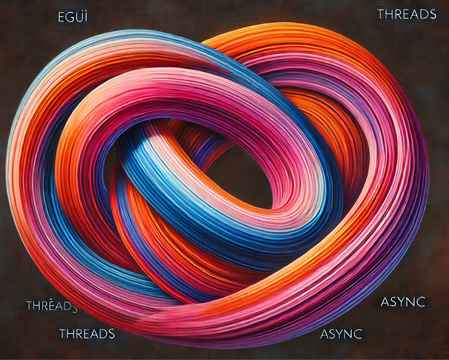

# Mobius_Egui  
Modular and ergonomic construction of egui applications. 

  

**Mobius_Egui** is a Rust framework designed to modularize and separate front-end and back-end logic in Egui applications. It emphasizes clean architecture with seamless communication between UI and business logic, inspired by the continuous, one-sided nature of the Möbius strip.  

## Why Mobius_Egui?  
In traditional Egui applications, UI and backend logic are often tightly coupled. Mobius_Egui solves this by providing a structured approach to communication between layers, improving maintainability and scalability.  

## Features  
- Clear separation of UI and business logic.  
- Flexible command and event processing using `std::mpsc`.  
- Modular design for cleaner, more maintainable code.  

## Quick Start
One can test out the examples by running these steps 
```bash
git clone git@github.com:saturn77/mobius_egui.git 
cd mobius_egui
cargo build
cargo run --example simple_monitor
```

## Installation
When using mobius_egui as a library, add the following to your `Cargo.toml`:  
```toml
[dependencies]
mobius_egui = "0.1.0"
eframe = "0.22"
egui = "0.22"
```  

## Usage  
Example of sending a command from the UI:  
```rust
if ui.button("First Task").clicked() {
    mobius_send_command!(self.command_sender, Command::FirstTask);
}
```  
Example backend processing:  
```rust
match command {
    Command::FirstTask => {
        logger_text.lock().unwrap().push_str("Processing FirstTask...\n");
        result_sender.send(CommandResult::Success("First Task completed!".to_string())).unwrap();
    }
}
```  

## Contributing  
Contributions are welcome! Please fork the repository, create a feature branch, and submit a pull request.  

## License  
This project is licensed under the MIT License.  

## Contact  
For support or questions, open an issue or reach out on [GitHub Discussions](https://github.com/saturn77/mobius_egui/discussions).  
